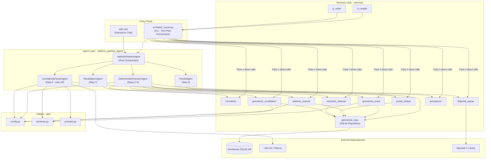

# Architecture Governance Report

**Project:** structured_address_ai_poc
**Date:** 2026-02-25
**Auditor:** ArchitectureAuthority Agent
**Report ID:** ARCHITECTURE_REVIEW_20260225_170000

---

## 1. Executive Summary

The **structured_address_ai_poc** system is a hybrid address-resolution pipeline built on Google ADK (Agent Development Kit). It employs a two-pass architecture: a fast deterministic pass (Steps 0-5) using libpostal, GeoNames SQLite lookups, and n-gram scanning, followed by an LLM fallback pass (Step 6) via LiteLLM/Ollama for unresolved rows (approximately 43%). Steps 7-8 (revalidation and persistence) run for all rows.

**Key Strengths:**
- Clean separation between agent orchestration and stateless service functions
- Well-designed two-pass hybrid architecture with measurable cost savings
- Robust defensive coding (graceful libpostal degradation, JSON fence-stripping, SSRF prevention)
- Pydantic-enforced I/O boundaries

**Key Risks:**
- **Dual-path divergence (R-01):** `batch_runner.py` duplicates the deterministic pipeline logic from the agent path, creating a maintenance hazard
- **Untyped state dictionary (R-02):** Session state is a plain `dict` passed through all agents and services, with no schema enforcement at boundaries
- **Sparse test coverage (R-03):** Only 3 test files covering 2 of 11 services; no agent tests; no integration tests
- **Normalizer code duplication (R-04):** `services/normalizer.py` and `src/preprocess.py` contain identical functions

**Overall Score: 7.0 / 10**

---

## 2. System Topology Diagram



**Dependency Observations:**
- No circular dependencies detected.
- `geonames_repo` is the convergence point for all data access (9 inbound edges).
- `batch_runner.py` bypasses the agent layer for deterministic rows, creating a parallel code path.

---

## 3. Architectural Style Classification

| Attribute | Classification |
|---|---|
| **Primary Style** | Pipeline / Pipes-and-Filters |
| **Secondary Style** | Agent-based Orchestration (Google ADK) |
| **Data Flow** | Sequential (8-step pipeline with conditional LLM branch) |
| **Concurrency Model** | asyncio with semaphore-bounded parallelism |
| **State Management** | Mutable dictionary passed through pipeline stages |
| **Persistence** | SQLite (read-only reference data); CSV/Excel (I/O) |
| **External Integration** | LiteLLM adapter to Ollama (dev) / Gemini (prod) |

The architecture is a **hybrid pipeline**: a deterministic fast path (pure Python function calls, ~1-5ms/row) and an LLM slow path (ADK agent sessions, ~10-15s/row). This is a pragmatic design for a POC, achieving good cost/performance characteristics while maintaining a single logical pipeline.

---

## 4. OOP Assessment

### 4.1 Encapsulation

| Component | Rating | Notes |
|---|---|---|
| Agent classes | Good | Each agent encapsulates its step logic behind `_run_async_impl` |
| Service modules | Adequate | Stateless functions operating on state dicts; no internal state leakage |
| `geonames_repo` | Adequate | Connection singleton with `atexit` cleanup; internal helpers prefixed with `_` |
| Pydantic models | Good | Field validators enforce constraints (e.g., confidence clamping, country code uppercasing) |

**Finding E-01:** `AddressPipelineAgent` mutates `self.llm_parser.instruction` at runtime (line 129 of `address_pipeline_agent/agent.py`). In a concurrent scenario, this is a shared-state race condition. **Severity: Medium.**

### 4.2 Abstraction

| Component | Rating | Notes |
|---|---|---|
| Agent base class | Good | `BaseAgent` from ADK provides consistent `_run_async_impl` contract |
| Service functions | Adequate | Each service has a clear `state -> state` contract, but no formal interface |
| Repository layer | Good | `geonames_repo` abstracts all SQLite access behind named functions |

**Finding A-01:** No abstract base class or protocol defines the service contract (`def step(state: dict) -> dict`). Services are coupled only by convention. **Severity: Low.**

### 4.3 Inheritance

All four agent classes inherit directly from `BaseAgent`. No deep inheritance chains. No inheritance misuse detected.

### 4.4 Composition Quality

| Pattern | Evidence |
|---|---|
| Composition over inheritance | Root agent composes 4 sub-agents as Pydantic fields |
| Service delegation | Agents delegate all business logic to service functions |
| Tool registry | `LlmAddressParserAgent` composes tool functions via `_TOOL_FUNCTIONS` dict |

### 4.5 Coupling and Cohesion

| Module | Cohesion | Afferent Coupling | Efferent Coupling |
|---|---|---|---|
| `geonames_repo` | High | 6 services + LLM tools | 1 (config) |
| `batch_runner` | Medium | 1 (CLI) | 10+ (all services + agent) |
| `normalizer` | High | 5 services | 0 |
| `LlmAddressParserAgent` | High | 1 (orchestrator) | 4 (repo, config, schemas, litellm) |

**Finding C-01:** `batch_runner.py` (705 lines) has high efferent coupling (imports 10+ modules) and mixed responsibilities (CLI parsing, checkpoint management, two-pass orchestration, progress reporting). **Severity: Medium.**

### 4.6 God Classes

**Finding G-01:** `batch_runner.py` at 705 lines is a procedural "God module" combining CLI, I/O, checkpointing, deterministic resolution, LLM dispatch, and reporting. It is not a class, but it violates the single-responsibility principle at the module level. **Severity: Medium.**

### 4.7 Anemic Domain Models

**Finding AD-01:** The Pydantic models in `utils/schemas.py` (`AddressInput`, `AddressOutput`, `LlmAddressOutput`) are data-only with minimal behavior (only validators). All business logic lives in service functions. This is an **intentional design choice** for a pipeline architecture and is not a defect in this context — but should be noted as architectural decision. **Severity: Informational.**

---

## 5. SOLID Compliance Matrix

| Principle | Rating | Violations |
|---|---|---|
| **SRP** | Partial | V-SRP-01, V-SRP-02 |
| **OCP** | Good | V-OCP-01 |
| **LSP** | Good | No violations |
| **ISP** | Good | No violations |
| **DIP** | Partial | V-DIP-01, V-DIP-02 |

### V-SRP-01: `batch_runner.py` - Multiple Responsibilities
- **File:** `src/batch_runner.py` (705 lines)
- **Class/Module:** Module-level functions
- **Impact:** CLI argument parsing, checkpoint persistence, deterministic pipeline orchestration, LLM dispatch, progress reporting, and cost summary are all in one file.
- **Severity:** Medium

### V-SRP-02: `LlmAddressParserAgent` - JSON Parsing + LLM Communication
- **File:** `address_pipeline_agent/sub_agents/llm_parser/agent.py` (452 lines)
- **Class:** `LlmAddressParserAgent`
- **Impact:** The agent combines LLM communication, JSON fence-stripping, text-based tool-call detection, tool execution, and result validation. These are logically separate concerns.
- **Severity:** Low

### V-OCP-01: Hardcoded Tool Definitions
- **File:** `address_pipeline_agent/sub_agents/llm_parser/agent.py` (lines 96-173)
- **Impact:** `_TOOL_DEFINITIONS` is a handcrafted list of OpenAI-format tool schemas. Adding a new tool requires modifying this list, the `_TOOL_FUNCTIONS` dict, and the import block.
- **Severity:** Low

### V-DIP-01: Services Depend on Concrete `geonames_repo`
- **File:** All service modules under `services/`
- **Impact:** Services import concrete functions from `geonames_repo` rather than depending on an abstract repository interface. Swapping the data source (e.g., PostgreSQL for production) requires modifying every service.
- **Severity:** Medium

### V-DIP-02: `batch_runner` Directly Imports All Services
- **File:** `src/batch_runner.py` (lines 72-83)
- **Impact:** The batch runner imports 8 service modules directly, creating tight coupling to the service layer implementation.
- **Severity:** Low

---

## 6. Design Pattern Inventory

### 6.1 Confirmed Patterns

| Pattern | Type | Evidence | Location |
|---|---|---|---|
| **Pipeline / Pipes-and-Filters** | Behavioral | 8 sequential steps, each reading/writing to a shared state dict | `address_pipeline_agent/agent.py` + all sub-agents |
| **Strategy** | Behavioral | Conditional routing: deterministic vs. LLM resolution based on `status` | `address_pipeline_agent/agent.py` lines 122-148 |
| **Singleton** | Creational | Module-level `_connection` with lazy init + `atexit` cleanup | `services/geonames_repo.py` lines 30-66 |
| **Template Method** | Behavioral | All agents override `_run_async_impl` from `BaseAgent` | All agent classes |
| **Repository** | Structural | `geonames_repo` centralizes all data access behind named query functions | `services/geonames_repo.py` |
| **Facade** | Structural | Each service module provides a single entry-point function (`preprocess`, `parse`, `lookup`, `match`, `detect`, `scan`, `revalidate`, `persist`) | All `services/*.py` modules |

### 6.2 Pattern Resemblances

| Pattern | Evidence | Notes |
|---|---|---|
| Chain of Responsibility | Sub-agents run sequentially; each can short-circuit the pipeline | Resembles CoR but uses shared mutable state rather than passing a request object |
| Two-Phase Commit | `batch_runner.py` checkpoint/resume mechanism | Resembles 2PC in crash recovery semantics but is not a distributed transaction |

---

## 7. Anti-Pattern Detection

### AP-01: Shotgun Surgery (DRY Violation - Deterministic Pipeline)
- **Severity:** High
- **Evidence:** The deterministic resolution pipeline (Steps 0-5 + 7 + 8) is implemented twice:
  1. `address_pipeline_agent/sub_agents/deterministic_resolver/agent.py` (agent path, lines 67-157)
  2. `src/batch_runner.py` `_resolve_deterministic()` (batch path, lines 175-260)
- **Impact:** Any change to the deterministic pipeline must be applied in two places. Divergence between paths will produce inconsistent results. This is the highest-risk finding.

### AP-02: Shotgun Surgery (Helper Duplication)
- **Severity:** Medium
- **Evidence:** `_compute_delta()` and `_make_event()` helper functions are copy-pasted across 3 files:
  1. `address_pipeline_agent/sub_agents/deterministic_resolver/agent.py` (lines 34-53)
  2. `address_pipeline_agent/sub_agents/revalidation/agent.py` (lines 23-39)
  3. `address_pipeline_agent/sub_agents/persist/agent.py` (lines 23-39)
- **Impact:** Any fix to event construction must be applied in 3 places.

### AP-03: DRY Violation (Normalizer Duplication)
- **Severity:** Medium
- **Evidence:** `services/normalizer.py` (130 lines) and `src/preprocess.py` (118 lines) contain identical functions:
  - `normalize_unicode`, `collapse_whitespace`, `normalize_punctuation`, `casefold`, `to_ascii`, `normalize_for_matching`, `build_raw_address`, `tokenize`, `extract_ngrams`, `redact_pii`
- **Impact:** `geonames_etl.py` imports from `src.preprocess`; all runtime services import from `services.normalizer`. A bug fix in one will not propagate to the other.

### AP-04: Primitive Obsession (Untyped State Dictionary)
- **Severity:** Medium
- **Evidence:** The session state is a plain `dict[str, Any]` with ~30 keys managed by convention. Constants defined in `utils/schemas.py` (lines 178-212, `STATE_*`) are never imported or used by any module.
- **Impact:** Typos in state key strings cause silent bugs. No IDE autocompletion or type-checking for state access. The `STATE_*` constants are dead code.

### AP-05: Feature Envy
- **Severity:** Low
- **Evidence:** `AddressPipelineAgent._run_async_impl` (lines 120-153) reaches deeply into `state["llm_result"]` to extract and re-map fields (`town`, `postal_code`, `parser_source`). This logic belongs in the LLM agent or a dedicated mapper.

---

## 8. Architectural Risk Register

| ID | Risk | Severity | Likelihood | Impact | Affected Components |
|---|---|---|---|---|---|
| **R-01** | Dual-path divergence between agent and batch_runner deterministic pipelines | **Critical** | High | Inconsistent results between `adk web` and `batch_runner` CLI | `batch_runner.py`, `deterministic_resolver/agent.py` |
| **R-02** | Untyped session state dictionary allows silent key errors | **High** | High | Runtime bugs from typos; no static analysis possible | All agents, all services |
| **R-03** | Sparse test coverage (3 files, 0 agent tests, 0 integration tests) | **High** | High | Regressions go undetected; refactoring is unsafe | `tests/` |
| **R-04** | Normalizer code duplicated across `services/` and `src/` | **Medium** | Medium | Bug fixes not propagated; ETL and runtime may diverge | `normalizer.py`, `preprocess.py` |
| **R-05** | Race condition on `self.llm_parser.instruction` mutation | **Medium** | Low (POC) | Incorrect LLM prompts under concurrent `adk web` usage | `address_pipeline_agent/agent.py` line 129 |
| **R-06** | `STATE_*` constants in `schemas.py` are dead code | **Low** | Certain | Misleading documentation; developer confusion | `utils/schemas.py` lines 178-212 |
| **R-07** | Module-level SQLite singleton with `check_same_thread=False` | **Low** | Low | Thread-safety issues if non-asyncio threading is introduced | `services/geonames_repo.py` |
| **R-08** | No formal interface for repository layer | **Medium** | Medium | Migration to PostgreSQL requires modifying all service imports | All `services/` modules |

---

## 9. Governance Scorecard

| Dimension | Score (0-10) | Weight | Weighted |
|---|---|---|---|
| Modularity | 8.0 | 0.15 | 1.20 |
| Separation of Concerns | 6.5 | 0.15 | 0.98 |
| OOP Quality | 7.0 | 0.10 | 0.70 |
| SOLID Compliance | 6.5 | 0.15 | 0.98 |
| Pattern Usage | 8.0 | 0.10 | 0.80 |
| Anti-Pattern Severity | 5.5 | 0.10 | 0.55 |
| Test Coverage | 3.0 | 0.10 | 0.30 |
| Documentation | 8.5 | 0.05 | 0.43 |
| Maintainability | 6.5 | 0.10 | 0.65 |
| **TOTAL** | | **1.00** | **6.58** |

**Rounded Overall Score: 7 / 10**

**Rationale:**
- Strong modularity and clean agent/service separation earn high marks
- Excellent inline documentation (docstrings, design references to V3.2 spec)
- Test coverage is the weakest dimension (3/11 services tested, 0/4 agents tested)
- Dual-path duplication (AP-01) and untyped state (AP-04) are the primary maintainability risks

---

## 10. Strategic Recommendations

### Priority 1 - Critical (Address within 1-2 sprints)

**SR-01: Eliminate dual-path divergence (R-01, AP-01)**
Extract the deterministic pipeline into a shared function that both the `DeterministicResolverAgent` and `batch_runner._resolve_deterministic()` call. The agent becomes a thin wrapper that invokes the shared function and emits ADK events.

```
# Proposed structure:
services/deterministic_pipeline.py   # New: shared Steps 0-5 logic
  -> resolve_deterministic(state) -> state

DeterministicResolverAgent._run_async_impl:
  -> calls resolve_deterministic(state)
  -> emits events

batch_runner._resolve_deterministic:
  -> calls resolve_deterministic(state)
  -> no events needed
```

**SR-02: Introduce typed state (R-02, AP-04)**
Replace the plain `dict` with a Pydantic `SessionState` model (or at minimum a `TypedDict`). This enables static analysis, IDE support, and catches typos at definition time. Remove or integrate the dead `STATE_*` constants.

### Priority 2 - High (Address within 3-4 sprints)

**SR-03: Expand test coverage (R-03)**
- Add unit tests for all 11 service modules (target: 80% line coverage)
- Add agent-level tests using mocked services (test conditional routing, error handling)
- Add integration tests for the two-pass batch pipeline (deterministic + LLM paths)
- Populate `tests/benchmark/` with performance regression tests

**SR-04: Extract shared agent utilities (AP-02)**
Move `_compute_delta()` and `_make_event()` to a shared module (e.g., `address_pipeline_agent/event_helpers.py`) and import from all sub-agents.

**SR-05: Consolidate normalizer (R-04, AP-03)**
Delete `src/preprocess.py` and update `src/geonames_etl.py` to import from `services.normalizer`. This eliminates the duplication.

### Priority 3 - Medium (Address within 5-6 sprints)

**SR-06: Abstract the repository layer (R-08, V-DIP-01)**
Define a `GeoNamesRepository` protocol/ABC and have services depend on the abstraction. This enables swapping SQLite for PostgreSQL without modifying service code.

**SR-07: Fix LLM instruction mutation (R-05)**
Pass the instruction string as a parameter to the agent's `run_async` method (via state or context) rather than mutating `self.llm_parser.instruction`. This eliminates the race condition.

**SR-08: Decompose batch_runner (V-SRP-01, G-01)**
Split `batch_runner.py` into focused modules:
- `src/cli.py` - argument parsing and logging setup
- `src/checkpoint.py` - checkpoint read/write/resume logic
- `src/batch_orchestrator.py` - two-pass pipeline coordination
- `src/reporting.py` - batch summary and token accounting

---

*End of Architecture Governance Report*
